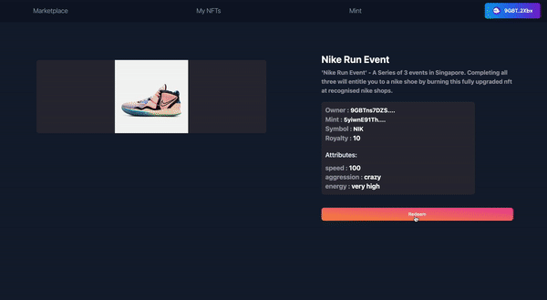

# animated-octo-winner
# silver-barnacle

# About

As it stands, current Token Gating solutions only serve as one off passes to events and gated digital content, essentially behaving as repurposed physical tickets. How can we leverage on the underlying technology behind NFTs to turn them into loyalty cards which can help brands build stronger connections with their community as well as reward users for their commmitment and loyalty?

Our solution Solmate aims to bridge Token Gating with the concept of Evolving NFTs to do just that. A user would buy an NFT and use it to become verified for an event as he would in typical Token Gating. However, an evenCount would be tied to the NFT as well, which increments with every event that the user goes for. After hitting a certain count, the NFT would evolve into a different tier (this is achieved through the mutation of the NFT's uri). The evolved NFT would entitle the user to new benefits / rewards like free merchandising and access to unique gated content. 

We believe that this concept would help to make NFT ownership and Token Gating a more interactive experience which will further encourage users to support their favourite brands, and onboard more people into Web 3.0!

For a deeper breakdown of our solution, please refer to our pitch deck!

This is the extended development for the frontend of the Solmate project done as part of the Solana Summer Camp Hackathon. The Solmate project can be found at [[Solmate Github]](https://github.com/maars202/solmate)

